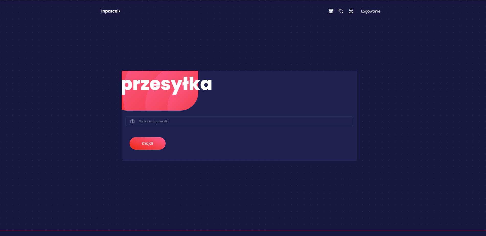
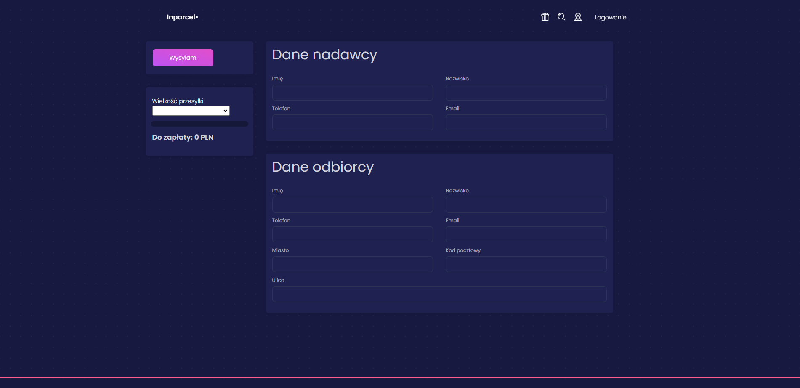
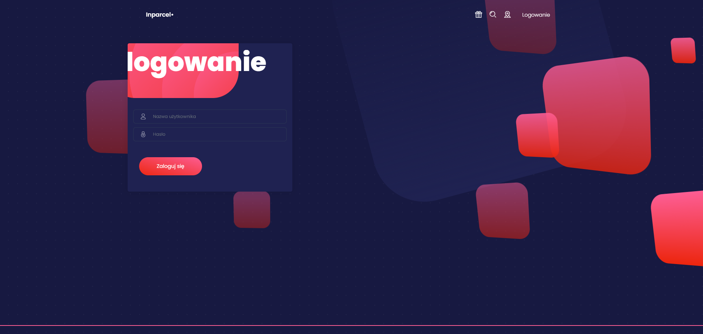

INPARCEL ANGULAR APPLICATION 1.5

This is a GUI project for courier parcels system with Angular 13+. 
It contains all of the specs from Angular's test guide as well as some extras. 

> Get Started

1. Clone the repo

 `git clone git@gitlab.com:sebastiansoja/warehouse-web-app-fr.git`
 
 `cd warehouse-web-app-fr`

2. Install npm packages

`npm install`

`npm start` 

The npm start command builds (compiles TypeScript and copies assets) the application into dist/, watches for changes to the source files, and runs server on port 4200.

Shut it down manually with Ctrl-C.

3. npm scripts

These are the most useful commands defined in package.json:

- npm start - runs the TypeScript compiler, asset copier, and a server at the same time, all three in "watch mode".
- npm run build - runs the TypeScript compiler and asset copier once.
- npm run build:watch - runs the TypeScript compiler and asset copier in "watch mode"; when changes occur to source files, 
  they will be recompiled  or copied into dist/.
- npm run lint - runs tslint on the project files.
- npm run serve - runs server.

1.  These are the test-related scripts:
- npm test - builds the application and runs Intern tests (both unit and functional) one time.
- npm run ci - cleans, lints, and builds the application and runs Intern tests (both unit and functional) one time.

> Overview

- Home screen

- Parcel add screen

- Logging page

**Frontend was created using https://www.creative-tim.com/ templates.**
